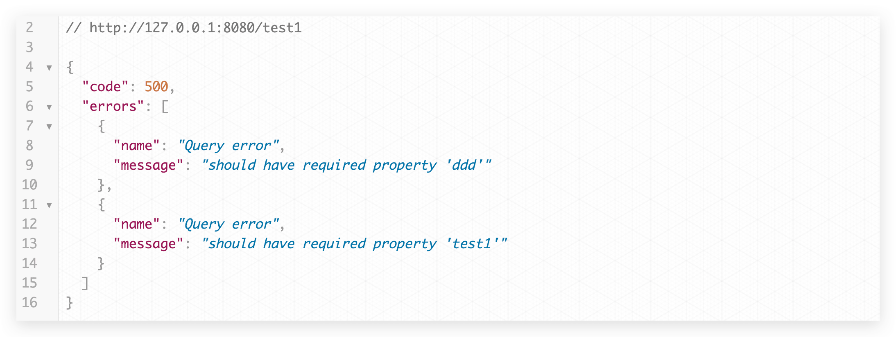
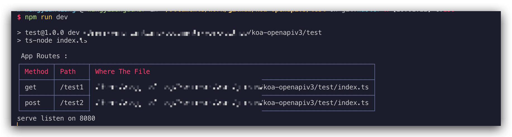
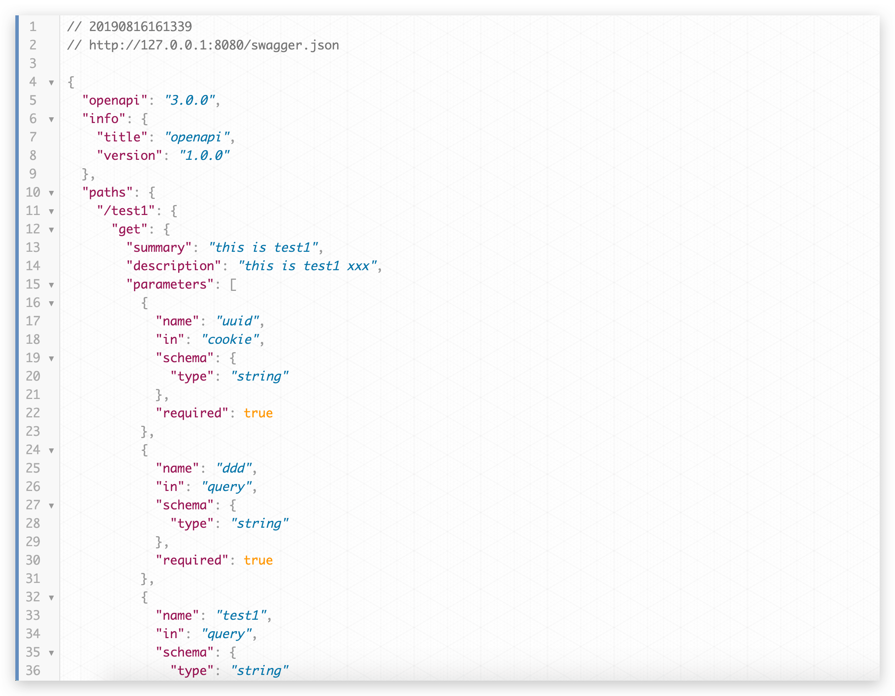
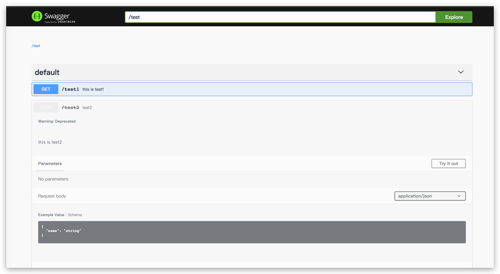

# koa-openapiv3
this is a koa middleware ，that validates header&amp;cookie&amp;params&amp;body&amp;parameters based on openapiv3 and displays doc and cli print routing information

## install
```js
npm install koa-openapiv3
yarn add koa-openapiv3
```

## require
```js
"koa": "^2.7.0",
"koa-body": "^4.1.1",
"koa-router": "^7.4.0"
```

## tips
```
requestBody.content.mime the request content-type field without parameters, such as charset.
e.g. `application/json` `text/plain`   `application/x-www-form-urlencoded`
if you do not like this ui ,you can use swagger json path custom ui
```
## 





## test
```bash
cd test
yarn
npm run dev
```

## method
```ts

interface Api {
    path: string
    path: string
    method: string
    operation: IOpenAPIOperation
    schema: IOpenAPI
    paramsSchema?: Dict<IOpenAPISchema>
    querySchema?: Dict<IOpenAPISchema>
    headerSchema?: Dict<IOpenAPISchema>
    cookieSchema?: Dict<IOpenAPISchema>
    payloadSchema?: Dict<IOpenAPISchema>
    constructor (schema: IOpenAPI, path: string, method: ApiMethod, option: IOpenAPIOperation)
    validate (data: any, schema: IOpenAPISchema, name: string): boolean
    getParams (ctx: Koa.ParameterizedContext, at: IOpenAPIParameterLocation): any
    addParamMetaSchema (params: IOpenAPIParameter, schema: IOpenAPISchema | undefined, root: IOpenAPISchema): IOpenAPISchema
    async getParamsSchema (at: IOpenAPIParameterLocation): Promise<Dict<IOpenAPISchema>>
    async getPayloadSchema (): Promise<Dict<IOpenAPISchema>>
    getPayload (ctx: Koa.ParameterizedContext<any, KoaBody>): any
    verify (): Koa.Middleware<any, KoaBody>
}

interface Swagger{
    apis: Api[]
    schema: IOpenAPI
    constructor (schema: Omit<IOpenAPI, 'paths'>)
    // show ui 
    static ui (config: IOpenAPI, json_path?: string, ui_path?: string, web_index_path?: string, web_static_path?: string): Koa.Middleware
    // cli print all routes
    print () void
    // add one router
    add (path: string, method: ApiMethod, option: IOpenAPIOperation, components?: IOpenAPIComponent): Api
} 
```
