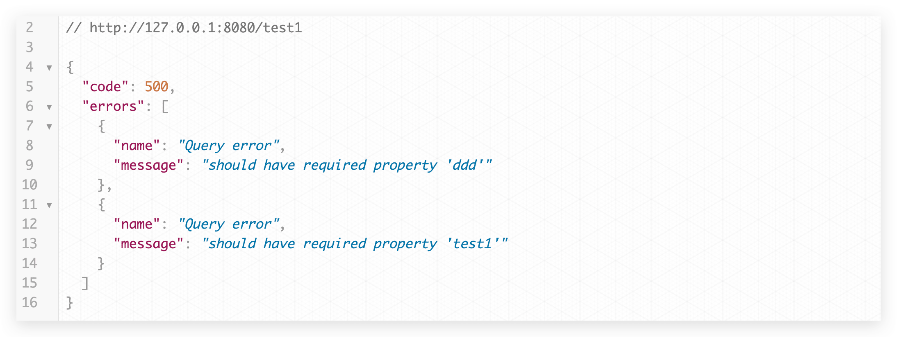
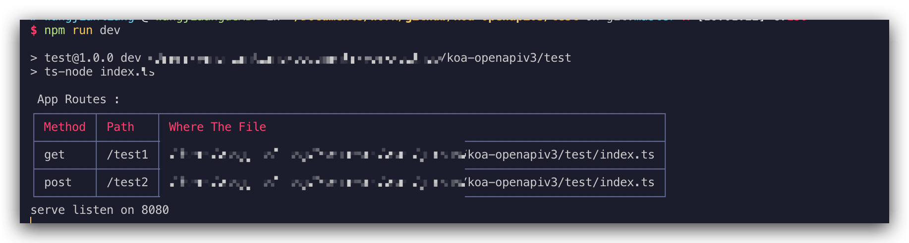
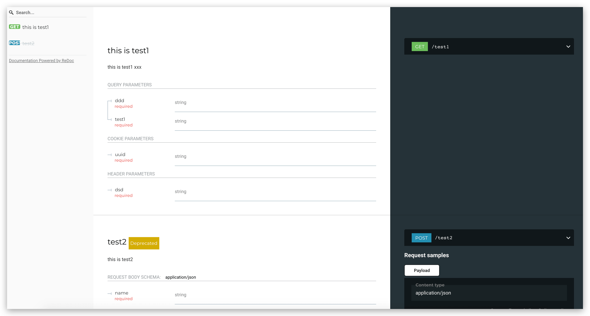
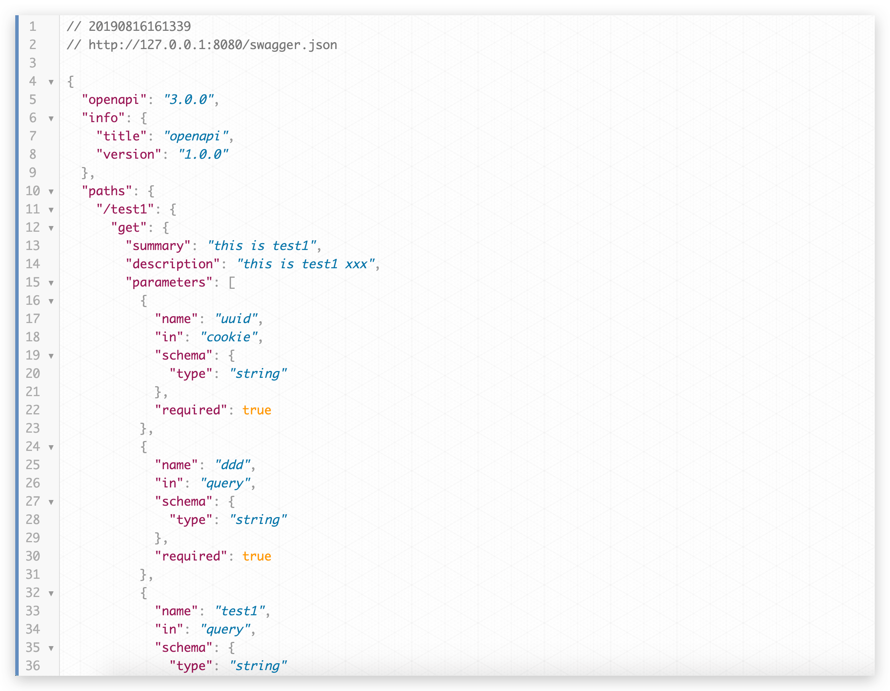

# koa-openapiv3
this is a koa middleware ，that validates header&amp;cookie&amp;params&amp;body&amp;parameters based on openapiv3 and displays doc and cli print routing information


## install
```js
npm install koa-openapiv3
yarn add koa-openapiv3
```

## require
```js
"koa": "^2.7.0",
"koa-body": "^4.1.1",
"koa-router": "^7.4.0"
```

## tips
```
requestBody.content.mime the request content-type field without parameters, such as charset.

e.g. `application/json` `text/plain`   `application/x-www-form-urlencoded`


if you do not like this ui ,you can use swagger json path custom ui


```

## example
```ts
import Koa from "koa";
import KoaRouter from "koa-router";
import KoaBody from "koa-body";
import Swagger from "../index";

let options = {
  port: 8080
};

let app: Koa = new Koa();
app.use(KoaBody());

const swagger = new Swagger();

const router = new KoaRouter();

const test1 = swagger.add({
  path: "/test1",
  method: "GET",
  filename: __filename,
  parameters: [
    {
      name: "uuid",
      in: "cookie",
      schema: {
        type: "string"
      },
      required: true
    },
    {
      name: "ddd",
      in: "query",
      schema: {
        type: "string"
      },
      required: true
    },
    {
      name: "dsd",
      in: "header",
      schema: {
        type: "string"
      },
      required: true
    }
  ],
  responses: {}
});

router[test1.method](test1.path, test1.do(), async ctx => {
  ctx.body = "success";
});

const test2 = swagger.add({
  path: "/test2",
  method: "POST",
  filename: __filename,
  requestBody: {
    content: {
      "application/json": {
        schema: {
          type: "object",
          properties: {
            name: {
              type: "string"
            }
          },
          required: ["name"]
        }
      }
    }
  },
  responses: {}
});

router[test2.method](test2.path, test2.do(), async ctx => {
  ctx.body = "success";
});

app.use(router.routes()).use(router.allowedMethods());

app.use(
  swagger.ui({
    routerPath: "/swagger.json",
    uiRouterPath: "/doc"
  })
);

swagger.printRoutes();

console.log("serve", `listen on ${options.port}`);

app.listen(options.port);

```

## method
```ts
type SwaggerOptionUI = {
  routerPath: string; //swagger json file path
  uiRouterPath?: string;    // swagger doc ui path
  openapi?: string;         // swagger v3 schema
  info?: OpenAPIInfo;       // swagger v3 schema
  paths?: OpenAPIPaths;     // swagger v3 schema
  components?: OpenAPIComponents;   // swagger v3 schema
  security?: OpenAPISecurityRequirement[];    // swagger v3 schema
  tags?: OpenAPITag[];        // swagger v3 schema
  externalDocs?: OpenAPIExternalDocumentation;      // swagger v3 schema
}

type SwaggerApiOption = {
  path: string;
  method: string;
  filename: string;
  errorMessage?: any;
} & OpenAPIOperation;


interface SwaggerApi {
  constructor(option: SwaggerApiOption)
  do(): Koa.Middleware
}

interface Swagger{
  //show ui 
  ui(config: SwaggerOptionUI): Koa.Middleware
  //cli print all routes
  printRoutes(): void
  //add one router
  add(config: SwaggerApiOption): SwaggerApi
}
  
  
```

## 




